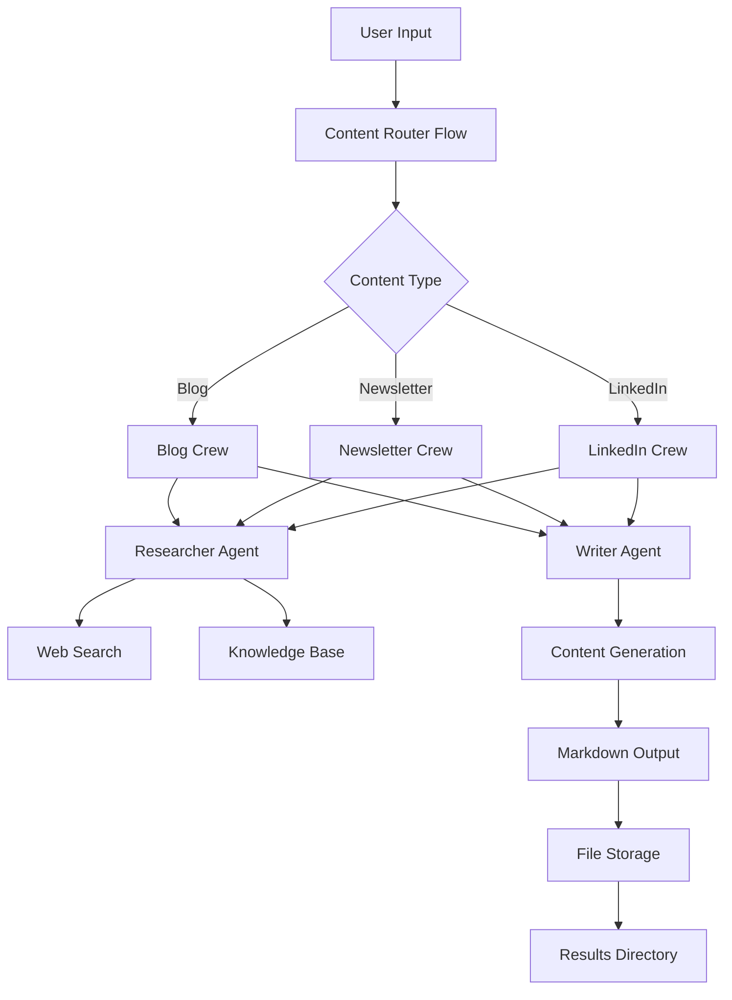

# Autonomous Content Creation System


Built a series of specialized agents, one for each role that we wanted to have in our team. This system demonstrates a sophisticated autonomous content creation framework using CrewAI, featuring event-driven architecture, state management, and specialized agents for different content formats.

## Table of Contents

1. [Overview](#overview)
2. [System Architecture](#system-architecture)
3. [Agent Architecture](#agent-architecture)
4. [Software Architecture](#software-architecture)
5. [Usage Guide](#usage-guide)
6. [Features](#features)
7. [Technical Specifications](#technical-specifications)
8. [Getting Started](#getting-started)
9. [Contributing](#contributing)
10. [License](#license)

## Overview <a name="overview"></a>

The Autonomous Content Creation System is an advanced multi-agent framework that transforms web content into structured, platform-specific content using specialized AI agents. The system leverages CrewAI's workflow orchestration to create engaging blog posts, newsletters, and LinkedIn content from external URLs.

### Key Highlights

- **Multi-Agent Collaboration**: Specialized agents work together seamlessly
- **Event-Driven Architecture**: Dynamic routing based on content type requirements
- **State Management**: Persistent workflow state with Pydantic models
- **Platform-Specific Content**: Tailored output for different social media platforms
- **Modular Design**: Extensible architecture for adding new content types

## System Architecture <a name="system-architecture"></a>



### Architecture Pattern

1. **Input Collection**: User provides URL and content type
2. **Dynamic Routing**: Content Router determines appropriate crew
3. **Agent Collaboration**: Researcher and Writer agents work in tandem
4. **Content Generation**: Platform-specific content creation
5. **State Management**: Workflow state persistence
6. **Output Storage**: Structured file organization

## Agent Architecture <a name="agent-architecture"></a>

### Agent Types and Roles

The system consists of three primary crew types, each with specialized researcher and writer agents:

#### 1. Blog Crew

```
┌─────────────────────────────────────────────────────────────┐
│                    Blog Researcher                        │
│ • Role: Blog Content Researcher                           │
│ • Goal: Extract insights for blog posts                    │
│ • Tools: Web Search, Knowledge Base                        │
│ • Output: Structured research summary                      │
└─────────────────────────────────────────────────────────────┘

┌─────────────────────────────────────────────────────────────┐
│                    Blog Writer                             │
│ • Role: Blog Content Writer                                │
│ • Goal: Create engaging blog posts                         │
│ • Output: 800-1200 word blog post                          │
│ • Format: Markdown with SEO optimization                   │
└─────────────────────────────────────────────────────────────┘
```

#### 2. Newsletter Crew

```
┌─────────────────────────────────────────────────────────────┐
│                 Newsletter Researcher                       │
│ • Role: Newsletter Content Researcher                       │
│ • Goal: Extract insights for newsletters                    │
│ • Tools: Web Search, Knowledge Base                        │
│ • Output: Focused research brief                             │
└─────────────────────────────────────────────────────────────┘

┌─────────────────────────────────────────────────────────────┐
│                 Newsletter Writer                          │
│ • Role: Newsletter Writer                                  │
│ • Goal: Create compelling newsletter content                │
│ • Output: 400-600 word newsletter section                   │
│ • Format: Email-optimized with subject line                │
└─────────────────────────────────────────────────────────────┘
```

#### 3. LinkedIn Crew

```
┌─────────────────────────────────────────────────────────────┐
│                 LinkedIn Researcher                         │
│ • Role: LinkedIn Content Researcher                         │
│ • Goal: Extract professional insights for LinkedIn           │
│ • Tools: Web Search, Knowledge Base                        │
│ • Output: Punchy insights with engagement potential          │
└─────────────────────────────────────────────────────────────┘

┌─────────────────────────────────────────────────────────────┐
│                 LinkedIn Writer                             │
│ • Role: LinkedIn Content Writer                             │
│ • Goal: Create engaging LinkedIn posts                      │
│ • Output: 150-300 word LinkedIn post                        │
│ • Format: Professional with hashtags and CTA                │
└─────────────────────────────────────────────────────────────┘
```

### Agent Design Principles

1. **Clear Separation of Concerns**: Researchers focus on extraction, writers on creation
2. **Role Specialization**: Each agent has specific goals and backstories
3. **Tool Integration**: Access to web search and knowledge base tools
4. **Context Awareness**: Writers use researcher outputs as context
5. **Output Validation**: Clear expected outputs for each task

## Software Architecture <a name="software-architecture"></a>

### Core Components

#### 1. Content Router Flow (`app/crewai_workflow_architecture/workflow_main.py`)

**Functionality**:
- Event-driven workflow orchestration
- Dynamic content type routing
- State management across workflow steps
- Persistent workflow storage

**Key Features**:
- CrewAI Flow decorators for workflow definition
- Router function for content type selection
- Listener functions for crew-specific processing
- State persistence via `@persist` decorator

#### 2. Agent Configuration (`app/crewai_workflow_architecture/agents.py`)

**LLM Configuration**:
```python
AGENT_LLM = LLM(
    base_url="https://openrouter.ai/api/v1",
    api_key=os.environ.get("OPENROUTER_API_KEY"),
    model="openrouter/cohere/north-mini-code:free",
    temperature=0.7
)
```

**Agent Design**:
- Shared LLM configuration across all agents
- Tool integration for research capabilities
- Context-aware task execution
- Configurable iteration limits

#### 3. Task Management (`app/crewai_workflow_architecture/tasks.py`)

**Task Structure**:
- Research tasks with clear extraction goals
- Writing tasks with specific formatting requirements
- Context dependencies between tasks
- Platform-specific word count and formatting

**Task Categories**:
- **Research Tasks**: Content extraction and analysis
- **Writing Tasks**: Content creation and formatting
- **Context Management**: Information flow between agents

#### 4. Tools (`app/crewai_workflow_architecture/tools.py`)

**Available Tools**:
- Web Search: DuckDuckGo integration via LangChain
- Content Extraction: URL-based information gathering
- Knowledge Base: Preloaded text processing
- Tool Wrapping: CrewAI decorator integration

### State Management

**ContentState Model** (`app/memory.py`):

```python
class ContentState(BaseModel):
    # User Inputs
    url: str = ""                    # used as a query string
    content_type: str = ""           # "blog" | "newsletter" | "linkedin"
    
    # Final generated content
    final_content: str = ""          
    
    metadata: Dict[str, Any] = {}
```

**State Management Features**:
- Pydantic models for type safety
- Persistent workflow state
- Metadata tracking
- Cross-component state sharing

## Usage Guide <a name="usage-guide"></a>

### Prerequisites

1. **Python Environment**: Python 3.10+
2. **Dependencies**: Install from requirements.txt
3. **API Key**: Set OPENROUTER_API_KEY environment variable
4. **Virtual Environment**: Recommended for dependency isolation

### Installation

```bash
# Clone the repository
cd /path/to/Autonomous-Content-Creation-System

# Create virtual environment (recommended)
python -m venv .venv
source .venv/bin/activate  # On Windows: .venv\Scripts\activate

# Install dependencies
pip install -r requirements.txt

# Set API key (add to ~/.bashrc or ~/.zshrc)
export OPENROUTER_API_KEY="your-api-key-here"
```

### Running the System

#### Basic Usage

```bash
# Navigate to project directory
cd /home/amir/my\ Projects\ on\ Github/Autonomous-Content-Creation-System

# Run the main workflow
python -m app.crewai_workflow_architecture.workflow_main
```

#### Interactive Mode

The system will prompt for:
1. **Root Path**: Directory where results should be saved
2. **URL**: Web page to process
3. **Content Type**: Choose from blog, newsletter, or LinkedIn

#### Validation Mode

```bash
# Run validation example
python -m app.crewai_workflow_validation.workflow_val
```

### Command Line Options

```bash
# Help and usage information
cat README.md  # This file

# Project exploration
find . -name "*.py" | grep -v __pycache__ | grep -v ".venv"

# View requirements
head -50 requirements.txt

# Check structure
ls -la app/
```

### Output and Results

#### Generated Content Structure

```
results/
├── blog/
│   ├── completion_2026-07-22_21-22-16.md
│   └── ...
├── linkedin/
│   ├── completion_2026-07-22_21-30-45.md
│   └── ...
└── newsletter/
    ├── completion_2026-07-22_21-45-20.md
    └── ...
```

#### File Format

All generated content is saved in Markdown format with:
- Professional formatting
- Platform-specific optimization
- Timestamps for version tracking
- Organized directory structure

## Features <a name="features"></a>

### Core Features

1. **Multi-Platform Content Generation**
   - Blog posts (800-1200 words)
   - Newsletters (400-600 words)
   - LinkedIn posts (150-300 words)
   - Custom content types

2. **Intelligent Content Extraction**
   - Web content analysis
   - Key insight identification
   - Professional formatting
   - Platform-specific optimization

3. **Workflow Orchestration**
   - Event-driven architecture
   - Dynamic content routing
   - State persistence
   - Parallel processing

4. **Extensible Design**
   - Modular agent system
   - Easy content type addition
   - Custom tool integration
   - Configuration management

### Advanced Features

1. **Knowledge Base Integration**
   - Preloaded text processing
   - Local content enhancement
   - Validation support

2. **Tool Integration**
   - Web search capabilities
   - Content analysis tools
   - Data extraction tools

3. **State Management**
   - Pydantic models
   - Persistent storage
   - Metadata tracking
   - Cross-component sharing

## Technical Specifications <a name="technical-specifications"></a>

### Technology Stack

**Framework**: CrewAI
- Event-driven workflow orchestration
- Multi-agent collaboration
- State management
- Tool integration

**Programming Language**: Python 3.10+
- Async/await support
- Type hints with Pydantic
- Modular architecture

**Dependencies**: 200+ packages
- AI/ML frameworks
- Web integration tools
- Development utilities

### Performance Characteristics

**Agent Performance**:
- **Iteration Limits**: 3 iterations per agent
- **LLM Configuration**: OpenRouter with temperature 0.7
- **Tool Usage**: Integrated web search capabilities
- **Context Management**: Context-aware task execution

**Workflow Performance**:
- **Processing Time**: Depends on content size and complexity
- **Memory Usage**: Managed by CrewAI
- **Scalability**: Horizontal agent expansion
- **Reliability**: Built-in fallback mechanisms

### Security and Compliance

**Security Features**:
- API key management
- Environment variable storage
- Tool permission controls
- Access validation

**Compliance Considerations**:
- Data handling policies
- Content usage rights
- Platform compliance
- Privacy protection

## Getting Started <a name="getting-started"></a>

### Quick Start Guide

1. **Setup**: Install dependencies and configure API key
2. **Run Basic Example**: Execute main workflow with sample input
3. **Explore Features**: Try validation mode and different content types
4. **Customize**: Modify agents and tasks for specific needs
5. **Deploy**: Use in production environments

### Example Usage

```python
# Example: Running the system programmatically
from app.crewai_workflow_architecture.workflow_main import ContentRouterFlow

flow = ContentRouterFlow()
url = "https://blog.crewai.com/pwc-choses-crewai/"
content_type = "blog"

result = flow.kickoff(
    inputs={
        "url": url,
        "content_type": content_type
    }
)
```

### Development Guidelines

**Coding Standards**:
- Follow PEP 8 style guidelines
- Use type hints for better code clarity
- Write comprehensive docstrings
- Implement error handling

**Testing Best Practices**:
- Test each agent individually
- Validate content generation
- Test workflow scenarios
- Check edge cases

## Contributing <a name="contributing"></a>

### Contribution Guidelines

1. **Fork the Repository**
2. **Create Feature Branch**
3. **Implement Changes**
4. **Add Tests**
5. **Update Documentation**
6. **Submit Pull Request**

### Common Contribution Areas

1. **New Content Types**
   - Add new agent in `agents.py`
   - Define tasks in `tasks.py`
   - Add listener in `workflow_main.py`

2. **Agent Enhancements**
   - Improve agent backstories
   - Add new tools
   - Optimize task descriptions

3. **Architecture Improvements**
   - Add new workflow patterns
   - Enhance state management
   - Improve tool integration

### Code Review Process

1. **Functionality Review**: Verify all features work correctly
2. **Performance Review**: Check efficiency and scalability
3. **Security Review**: Ensure proper access controls
4. **Documentation Review**: Update relevant documentation

## License <a name="license"></a>

This project is licensed under the MIT License. See the LICENSE file for details.

## Contact and Support

For questions, issues, or support:
- Check the documentation in this README
- Review the CLAUDE.md file for development guidance
- Submit issues through the repository system

## Changelog

### Version 1.0.0
- Initial release
- Multi-agent content creation system
- Event-driven architecture

### Upcoming Features
- [ ] Enhanced agent capabilities
- [ ] Advanced workflow patterns
- [ ] Improved state management
- [ ] Cloud deployment support

---

*Autonomous Content Creation System - Powered by CrewAI and Advanced AI Agents*
